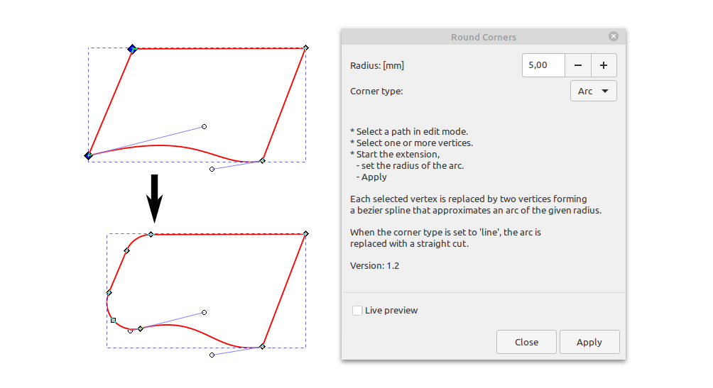

# inkscape-round-corners
An inkscape 1.0 extension to apply a radius to sharp corners of a path.

The screenshot below demonstrates the usage. 
In the upper path, select the top left and bottom left corner (shown in blue). 
Run "Rounded Corners" from "Extensions" -> "Modify Path". 
The result is the path below. (Also selected here in edit mode to show the vertices.)

The top left corner has a bit more than 90°, it is replaced with an spline path of two vertices representing an arc of a bit less than a quarter circle. 
The bottom left corner is acute ( < 90° ) and requires a spline of three vertices to nicely represent the desired arc.

Note how the bottom path segment is curved. 
In this case the direction of the spline handle is used to fit the arc. The direction and endpoint of the handle remain unchanged.
The curvature of the path segment adjusts slightly to fit the new endpoint.
